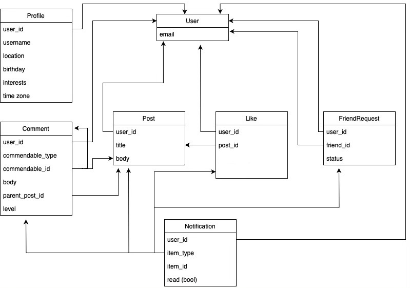

# Odin Project - Facebook Clone

This is an implementation of the [final project](https://www.theodinproject.com/lessons/ruby-on-rails-rails-final-project) in the [Odin Project's](https://www.theodinproject.com) Rails Path. 

It is a social media web app inspired by Facebook. 

See the live hosted on [Fly.io](https://so-social.fly.dev/).

## Features

- Log in / out
  - Authorization with the Devise Gem
  - Sign in with Google via Omniauth
- Profile
  - A user may create a profile
  - and an avatar
  - All profile fields are optional
  - If user chooses a time zone, dates/times will be displayed in that time zone. Otherwise Eastern Standard.
- Posts
  - A user can create posts consisting of text, an image, or both
  - New and edit forms for posts appear embedded with turbostreams
  - A user's "feed" of posts is broadcasted. 
- Comments
  - A user may comment on a post
  - or on another comment
  - Currently nested comments are limited to a depth of 2, but could in principle be infinite
  - New and edit forms for comments appear embedded with turbostreams
- Likes
  - A user may like/unlike a post (counts of which are also displayed with turbostreams) 
- Friends/Friend Requests
  - A user can send (and rescind) friend requests to other users 
  - A user must accept a friend request in order to become friends
- Notifications 
  - are sent whenever:
    - a friend publishes a new post
    - someone comments on a user's post 
    - someone replies to user's comment
    - user has received a friend request 
  - New notifications are broadcasted and so appear in real time
- Search
  - A user may search for other users 
  - search is performed on both email and username
- Unit and controller tests
- Miscellaneous
  - Stimulus controller actions to open and close the navigation menu, and toggle the visibility of declined friend requests
  - Custom error pages
  - Light and dark modes
  - Mobile layout

## The Database

(not including Active Storage image uploads)

 

## Screenshots

A user's show page (light mode):

The navigation menu (light mode):

Post show page (light mode):

User index page with search results (light mode):

New post form, embedded in page with Turbo Frame (dark mode):

New comment form, embedded with Turbo Frame (dark mode):

Friend Request index page (dark mode):

Error page (dark mode):

### Built with

- Rails 7.0.5
- Ruby 3.1.2